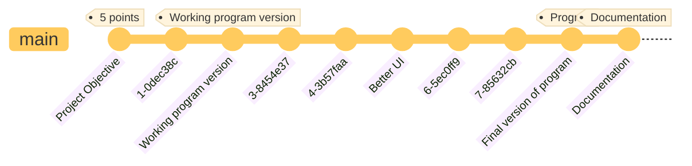

<style>
p, ul, li {
font-size: 10pt;
text-align: justify;
line-height: 16pt;
}

td p {
text-align: left;
}

pre {
font-size: 8pt;
margin: 0;
}

img {
padding: 1pt;
}

hr {
opacity: 0;
page-break-after: always;
}

text {
font-size: 8pt;
line-height: 0;
}

.grid-2 {
display: grid;
grid-template-columns: repeat(2, minmax(0, 1fr));
gap: 1.5rem
}

.grid-3 {
display: grid;
grid-template-columns: repeat(3, minmax(0, 1fr));
gap: 1.5rem
}
</style>

# Airline management system


As part of the course, we needed to implement a software solution for:

> Path planning
>
> Journeys can be very complex events that can really benefit from software support. They often involve detours in order
> to visit places of interest close to the main route. Various services and events may be offered at these locations.
> These places can be recommended based on the needs and boundaries of the traveler. The original itinerary may change
> during the trip. Traveling in a group may involve synchronizing detours. Whether the travel plan is created by a
> professional or by the travelers themselves, it may be worthy of sharing with others.

My decision was made - to implement a system for ordering tickets on a train - a plane. So, trains and airplanes are the
most common form of long-distance transportation.

### Selected technologies

In my project - I decided to use the following techniques:

<div class="grid-2">

- **Java 19** is one of the latest versions of Java and has many new features and improvements. Using the new Java
  features
  can simplify development and make code more readable.

- **Spring Boot** is a Java web application development framework that simplifies and speeds up the process of creating
  applications. It provides a number of handy tools and features such as automatic application configuration and
  assembly, integration with databases, and the ability to easily create REST APIs.

- **Spring Web** is a module of the Spring framework that provides functionality for building web applications. It makes
  it
  easy to create REST APIs and handle HTTP requests and responses.
    - **Mustache template manager** - a template engine that allows you to create HTML pages using templates. It is very
      simple and easy to use.
    - **Tailwind CSS** - a CSS framework that makes it easy to create responsive web pages. It provides a number of
      pre-defined styles and components that can be used to create a web page.

- **HyperSQL** is an open relational database in Java. It can be used to create local or remote databases, and has many
  features such as SQL support, indexing, transactions, etc.

- And of course a **Maven** build tool that makes it easy to manage dependencies and build the project:

```xml

<dependencies>
    <dependency>
        <groupId>org.springframework.boot</groupId>
        <artifactId>spring-boot-starter-web</artifactId>
    </dependency>
    <dependency>
        <groupId>org.springframework.boot</groupId>
        <artifactId>spring-boot-starter-mustache</artifactId>
    </dependency>
    <dependency>
        <groupId>org.springframework.boot</groupId>
        <artifactId>spring-boot-devtools</artifactId>
        <scope>runtime</scope>
        <optional>true</optional>
    </dependency>
    <dependency>
        <groupId>org.springframework.boot</groupId>
        <artifactId>spring-boot-starter-mail</artifactId>
    </dependency>
    <dependency>
        <groupId>org.springframework.boot</groupId>
        <artifactId>spring-boot-starter-data-jpa</artifactId>
    </dependency>
    <dependency>
        <groupId>org.springframework.boot</groupId>
        <artifactId>spring-boot-starter-test</artifactId>
        <scope>test</scope>
    </dependency>
    <dependency>
        <groupId>org.hsqldb</groupId>
        <artifactId>hsqldb</artifactId>
        <scope>runtime</scope>
    </dependency>
    <dependency>
        <groupId>org.projectlombok</groupId>
        <artifactId>lombok</artifactId>
        <optional>true</optional>
    </dependency>
</dependencies>
```

</div>

### Versions

Unfortunately due to a hashing failure on the local and remote server - I've lost my commit history. Everything should
have looked like this:



#### Project Objective

- index.md - file with project description and next wanted features to implement
- pom.xml - file with project dependencies I'll use

#### Working program version

- dao/model/ - all required classes with relations that you can see in the UML diagram.
- dao/repository/ - all required interfaces that I'll use to work with database.
- api/controllers/ - rest api controllers to manage all requests and return a correct mustache template with provided
  required data.
- services/ - all complex logic.
- resources/templates/ - all static files that I'll use in the project.

#### Better UI

- resources/templates/ - changed all mustache with Tailwind CSS templates to make them more user-friendly.

#### Working version

- services/ - added more complex logic to handle email sending for example.

#### Documentation

- resources/index.md - documentation file with all required information about the project.

### 🫠 My thinking about

In my opinion, my project should be given a maximum score, or one that comes close to it. Why? Because of:

- I have implemented all the criteria.
- I've used half the technology
- And also put some soul into this project.

## Problem definition

An airline management system is a piece of software that is used to efficiently handle all aspects of the airline
system. Every airline now has a management system in place to digitize the process of scheduling flights, managing
workers, making ticket bookings, and executing other airline management operations. Furthermore, the system maintains
track of the quantity of aircraft, pilots, and airport availability. Customers may check available flights and arrange
them online using the system's comprehensive flight information. Similarly, the administrator may use this system to
manage all airline activity. As a result, the airline management system assists consumers as well as administrators and
regulates all airline operations.

## Design approach

### UML class diagram

As the number of classes as well as the number of all attributes and methods is large, the UML-Diagram itself is huge,
so here is part of it:

You can see the full version in the attached file.

### Classes definitions

All definitions for classes you can find in the comments in the code.

But basically all classes are divided into 3 packages:

- dao/model/ - all required classes with relations.
- services/ - all complex logic that have a main chain of handling a reservation for example.
- api/controllers/ and etc. - for manage gui and rest api requests.

## OOP criteria and principles

### Basic principles

### Design patterns

### Custom extensions

### Front-end solution

### Multithreading

### Generic types

### RTTI #todo

### Nested classes #todo

### Lambda expressions

### Default method implementation

### AspectJ

### Serialization

###

