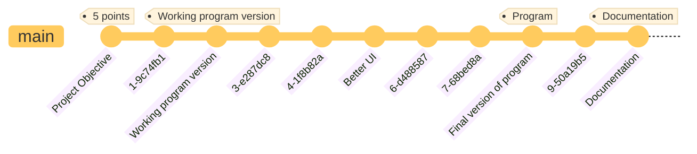

# Airline management system


As part of the course, we needed to implement a software solution for:

> Path planning
>
> Journeys can be very complex events that can really benefit from software support. They often involve detours in order
> to visit places of interest close to the main route. Various services and events may be offered at these locations.
> These places can be recommended based on the needs and boundaries of the traveler. The original itinerary may change
> during the trip. Traveling in a group may involve synchronizing detours. Whether the travel plan is created by a
> professional or by the travelers themselves, it may be worthy of sharing with others.

My decision was made - to implement a system for ordering tickets on a train - a plane. So, trains and airplanes are the
most common form of long-distance transportation.
---

### Selected technologies

In my project - I decided to use the following techniques:

<div class="grid-2">

- **Java 19** is one of the latest versions of Java and has many new features and improvements. Using the new Java
  features
  can simplify development and make code more readable.

- **Spring Boot** is a Java web application development framework that simplifies and speeds up the process of creating
  applications. It provides a number of handy tools and features such as automatic application configuration and
  assembly, integration with databases, and the ability to easily create REST APIs.

- **Spring Web** is a module of the Spring framework that provides functionality for building web applications. It makes
  it
  easy to create REST APIs and handle HTTP requests and responses.
    - **Mustache template manager** - a template engine that allows you to create HTML pages using templates. It is very
      simple and easy to use.
    - **Tailwind CSS** - a CSS framework that makes it easy to create responsive web pages. It provides a number of
      pre-defined styles and components that can be used to create a web page.

- **HyperSQL** is an open relational database in Java. It can be used to create local or remote databases, and has many
  features such as SQL support, indexing, transactions, etc.

- And of course a **Maven** build tool that makes it easy to manage dependencies and build the project:

```xml

<dependencies>
    <dependency>
        <groupId>org.springframework.boot</groupId>
        <artifactId>spring-boot-starter-web</artifactId>
    </dependency>
    <dependency>
        <groupId>org.springframework.boot</groupId>
        <artifactId>spring-boot-starter-mustache</artifactId>
    </dependency>
    <dependency>
        <groupId>org.springframework.boot</groupId>
        <artifactId>spring-boot-devtools</artifactId>
        <scope>runtime</scope>
        <optional>true</optional>
    </dependency>
    <dependency>
        <groupId>org.springframework.boot</groupId>
        <artifactId>spring-boot-starter-mail</artifactId>
    </dependency>
    <dependency>
        <groupId>org.springframework.boot</groupId>
        <artifactId>spring-boot-starter-data-jpa</artifactId>
    </dependency>
    <dependency>
        <groupId>org.springframework.boot</groupId>
        <artifactId>spring-boot-starter-test</artifactId>
        <scope>test</scope>
    </dependency>
    <dependency>
        <groupId>org.hsqldb</groupId>
        <artifactId>hsqldb</artifactId>
        <scope>runtime</scope>
    </dependency>
    <dependency>
        <groupId>org.projectlombok</groupId>
        <artifactId>lombok</artifactId>
        <optional>true</optional>
    </dependency>
</dependencies>
```

</div>

---

### 🐛 Versions

Unfortunately due to a hashing failure on the local and remote server - I've lost my commit history. Everything should
have looked like this:



#### Project Objective

- index.md - file with project description and next wanted features to implement
- pom.xml - file with project dependencies I'll use

#### Working program version

- dao/model/ - all required classes with relations that you can see in the UML diagram.
- dao/repository/ - all required interfaces that I'll use to work with database.
- api/controllers/ - rest api controllers to manage all requests and return a correct mustache template with provided
  required data.
- services/ - all complex logic.
- resources/templates/ - all static files that I'll use in the project.

#### Better UI

- resources/templates/ - changed all mustache with Tailwind CSS templates to make them more user-friendly.

#### Working version

- services/ - added more complex logic to handle email sending for example.

#### Documentation

- resources/index.md - documentation file with all required information about the project.

### 🫠 My thinking about

In my opinion, my project should be given a maximum score, or one that comes close to it. Why? Because of:

- I have implemented all the criteria.
- I've used half the technology
- And also put some soul into this project.

---

## Problem definition

An airline management system is a piece of software that is used to efficiently handle all aspects of the airline
system. Every airline now has a management system in place to digitize the process of scheduling flights, managing
workers, making ticket bookings, and executing other airline management operations. Furthermore, the system maintains
track of the quantity of aircraft, pilots, and airport availability. As a result, the airline management system assists
consumers as well as administrators and
regulates all airline operations.

## Design approach

### UML class diagram

As the number of classes as well as the number of all attributes and methods is large, the UML-Diagram itself is huge,
so here is part of it:


> You can see the full version in the attached file.

### Classes definitions

All definitions for classes you can find in the comments in the code. But basically all classes are divided into 3
packages:

- dao/model/ - all required classes with relations.
- services/ - all complex logic that have a main chain of handling a reservation for example.
- api/controllers/ and etc. - for manage gui and rest api requests.

---

## OOP criteria and principles

> The main criteria in project assessment are the extent to which the assignment is fulfilled, application of
> object-oriented mechanisms in the program (an appropriate use of inheritance, encapsulation, and aggregation), code
> organization, and documentation quality.

### Basic principles

Basic principles of OOP. In my project I've used:

### Inheritance

For example in my project I've used inheritance in the following class:


### Encapsulation

I am using encapsulation in every class. To not make my code as a scrapyard I've used a lombok annotations. For
example:

```java

@Data // ! this annotation generate all getters and setters for all fields
@Entity
@Table(name = "itinerary")
public final class Itinerary {
    @Id
    @GeneratedValue(strategy = GenerationType.AUTO)
    private long id;

    @ManyToOne
    private Airport startingAirport;
    @ManyToOne
    private Airport finalAirport;
    private LocalDateTime creationDate;

    @OneToMany(cascade = CascadeType.ALL, orphanRemoval = true)
    private List<FlightReservation> reservations = new LinkedList<>();

    /**
     * @return all unique passengers in a reservation
     */
    @JsonProperty(value = "passengers", required = true)
    public Collection<Passenger> getAllPassengers() {
        return this.reservations.stream()
                .map(FlightReservation::getPassengers)
                .flatMap(Collection::stream)
                .collect(Collectors.toSet());
    }
}
```

### Polymorphism

I am using a polymorphism for example in Observers:

```java
public interface NotificationListener {
    void handleSend(Person person, NotificationType type);
}

// ...

@Component
public class EmailNotificationListener implements NotificationListener {

    private final JavaMailSender emailSender;

    @Autowired
    public EmailNotificationListener(
            JavaMailSender emailSender
    ) {
        this.emailSender = emailSender;
    }

    @Override
    public void handleSend(Person person, NotificationType type) {
        // ...
    }
}
```

### Abstraction

For example an abstract chain class:

```java
/**
 * Abstract class for process element.
 *
 * @param <R> handler request
 * @param <T> object for changing
 */
@Setter
public abstract class AbstractProcessElement<R, T> implements ProcessElement<R, T> {

    private BiFunction<R, T, T> next;

    protected T callNext(R request, T object) {
        if (next != null) {
            return next.apply(request, object);
        }
        return object;
    }
}
```

---

### Design patterns

I've used the following design patterns:

### Chain of responsibility

To handle creation reservation process I've used a chain of responsibility pattern:


### Observers

I am using to handle notification for a users.


---

### Custom extensions

I've used the following custom extensions:

<div class="grid-2">

```java

@EqualsAndHashCode(callSuper = true)
@Data
public class TOSException extends RuntimeException {
    private Object[] args;
    private ExceptionCode code;

    public TOSException(ExceptionCode code) {
        super(code.getMessage());
        this.code = code;
    }

    public TOSException(String message, ExceptionCode code) {
        super(message);
        this.code = code;
    }

    public TOSException(Object[] args, ExceptionCode code) {
        super(code.getMessage());
        this.code = code;
    }
}
```


</div>

---

### Front-end solution

<div class="grid-3">

<div style="border: 1px solid #ccc; border-radius: 10px">


</div>

<div style="grid-column: span 2 / span 2;">


> All client and admin requests are handled by the same controllers, but the admin has more options.

</div>
</div>

---

### Multithreading

I've used multithreading for sending emails to users for example. And I am using a new thread like this:

```java
public class FindItineraryResponse {

    public FindItineraryResponse(List<List<FlightInstance>> routes) {
        this.routes = routes.stream()
                .parallel() // that is actually multithreading
                .map(route ->
                        new FindItineraryWithLink(
                                route,
                                route.stream()
                                        .map(FlightInstance::getId)
                                        .map(String::valueOf)
                                        .collect(Collectors.joining(","))
                        )
                )
                .toList();
    }
}
```

---

### Generic types

In my project I've used generic types for example in the following class:

```java
public interface ProcessElement<R, T> {
    T handler(R request, T object);
}

//...

public interface ProcessChainService<R, T> {
    T evalute(R request, T object);
}

//..

public class CreateReservationProcess extends AbstractProcessElement<ReserveItineraryRequest, Itinerary> {
}
```

---

### Lambda expressions

I am using stream api, so every function in stream is a lambda expression. For example:

```java
public class FindItineraryResponse {
    List<FindItineraryWithLink> routes;

    public FindItineraryResponse(List<List<FlightInstance>> routes) {
        this.routes = routes.stream()
                .map(route -> // ! here you go. That is a lambda expression
                        new FindItineraryWithLink(
                                route,
                                route.stream()
                                        .map(FlightInstance::getId)
                                        .map(String::valueOf)
                                        .collect(Collectors.joining(","))
                        )
                )
                .toList();
    }
}
```

Or storing a function in a variable:

```java
public abstract class AbstractProcessElement<R, T> implements ProcessElement<R, T> {

    private BiFunction<R, T, T> next; // here you go. That is a lambda expression

    protected T callNext(R request, T object) {
        if (next != null) {
            return next.apply(request, object);
        }
        return object;
    }
}

```

---

### AspectJ

I am using lombok annotation. For example:

```java

@EqualsAndHashCode(callSuper = true)
@Data
@Entity
@Table(name = "crew")
@DiscriminatorValue("crew")
public class Crew extends Person {
}
```

---

### Serialization

Here is an example of serialization:

```java

@Data
@Entity
@Table(name = "notification")
public class Notification implements Serializable {
    @Id
    @GeneratedValue(strategy = GenerationType.AUTO)
    private long id;

    private NotificationType type;

    @CreatedDate
    private Date createdDate;

    @ManyToOne
    private Person person;
}
```

And all writing to file is handled by spring boot and hyper-sql.
